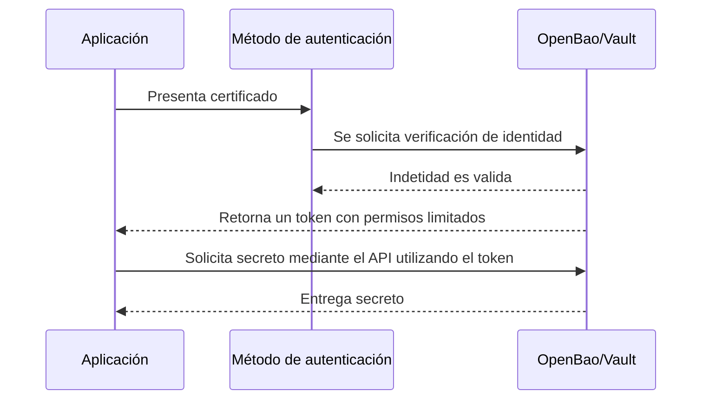

# Método de autenticación

## Método de autenticación implementado

Para esta implementación se propone utilizar "cert auth" como medio de autenticación entre aplicativos o entornos con la boveda, ya que funciona nativamente con la API de vault y no está restringida al entorno en el que el aplicativo consumidor de secretos se encuentre.

Bajo este modelo, un aplicativo consumidor presenta su certificado al gestor de secretos, el cual verifica la cadena de confianza, válida los atributos definidos para la identidad y en caso de ser autorizado, emite un token con permisos limitados basado en las políticas asociadas a dicha identidad.

<center>



</center>


## Organización de secretos

Si bien existen distintas formas de organizar los secretos dentro de la bóveda, para esta implementación se propone utilizar una estructura jerárquica que permite la separación de información según la aplicación que la consume. Este enfoque facilita la aplicación de políticas de acceso específicas a una identidad y evita el acceso a rutas compartidas donde no es necesario, aplicando una restricción granular sobre los espacios a la que cada una puede acceder.

```text
kv/ 
 ├── application/ 
 │    ├── payment-ms/
 │    │    ├── secret_1 
 │    │    └── billing-api-key 
 │    ├── billing-ms/ 
 │    │    └── secret_2 
 │    │    └── payment-api-key
```

## Políticas de acceso.

Las políticas de acceso son el principal mecanismo mediante el cual se controla la interacción entre identidades de las aplicaciones y los secretos almacenados, ya que definen de manera explícita qué operaciones puede realizar la identidad asociada sobre las rutas específicas dentro del sistema.

En la implantación propuesta, se espera que las políticas sigan el principio de mínimo privilegio, el cual establece que cada aplicación debe contar únicamente con los permisos estrictamente necesarios para cumplir su función.

Continuando con el ejemplo de la sección anterior, las políticas definidas para cada servicio se verían de la siguiente manera:

- payment-ms

```hcl
path "kv/data/application/payment-ms/*" {
  capabilities = ["read", "update"]
}
```

- billing-ms 

```hcl
path "kv/data/application/payment-ms/*" {
  capabilities = ["read", "update", "list"]
}
```

## Asociación de políticas

Al utilizar Cert-Auth, es necesario asociar el certificado como identidad a una política especifica aplicada a la bóveda, de esta manera el token que se genere cuando se dé el proceso de autenticación, tendrá habilitadas las acciones correspondientes para dicha identidad.

Una política se puede crear con el siguiente comando (el EOF puede ser reemplazado por un archivo con extensión hcl)

```bash

vault policy write payment-policy - <<'EOF'

path "kv/data/application/payment-ms/*" {
  capabilities = ["read", "update"]
}

EOF

```

Y su asociación se realiza mediante el comando: 

```bash
vault write auth/cert/certs/payment-ms \
  display_name="payment-ms" \
  policies="payment-policy" \
  certificate=@/vault/ssl/ca.crt \
  allowed_common_names="payment-ms" \
  ttl="1h"
```

Donde:
- policies es el nombre de la política creada anteriormente.
- certificate es la CA que se utilizará para validar la firma de los certificados.
- allowed_common_names es el método  seleccionado en este ejemplo como medio de identificación del certificado, por lo que vault comprobará la firma y el campo definido para asociarlos.
- ttl es el Time To Live del token a generar, por lo que después de ese tiempo, es necesario autenticarse de nuevo.

!!! nota
    Es posible utilizar uno o más campos del certificado como el DNS SAN, URI SAN, EMAIL SAN, Organization, entre otros. 

    Por otro lado, también se puede usar el certificado como tal para la relación de identidad, por lo que utilizaría el fingerprint del mismo, sin embargo, cada vez que el certificado del cliente expire será necesario aplicar las políticas nuevamente, contrario al uso de cualquiera de las propiedades descritas, el cual permite el funcionamiento continuo de la definición de la asociación incluso cuando el certificado se renueva.


Puede encontrar un diagrama del flujo de autenticación completo en [Cert-auth flow](docs/17-vault-cert-auth-flow.md)