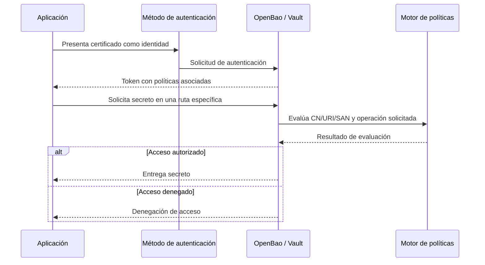

## Flujo final de autenticación

A continuación se presenta un diagrama con el flujo de autorización y validación de políticas dentro de Vault.

```mermaid
sequenceDiagram
    participant App as Aplicación
    participant Auth as Método de autenticación
    participant Bao as OpenBao / Vault
    participant Policy as Motor de políticas

    App->>Auth: Presenta certificado como identidad
    Auth->>Bao: Solicitud de autenticación
    Bao-->>App: Token con políticas asociadas

    App->>Bao: Solicita secreto en una ruta específica
    Bao->>Policy: Evalúa CN/URI/SAN y operación solicitada
    Policy-->>Bao: Resultado de evaluación

    alt Acceso autorizado
        Bao-->>App: Entrega secreto
    else Acceso denegado
        Bao-->>App: Denegación de acceso
    end
```