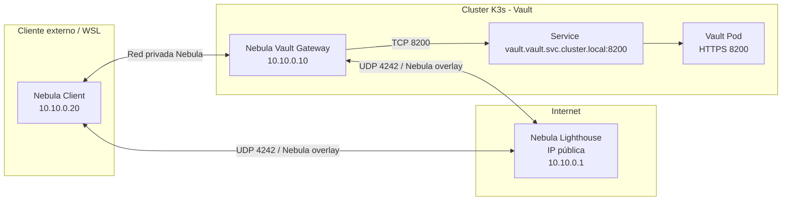
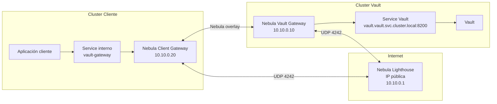
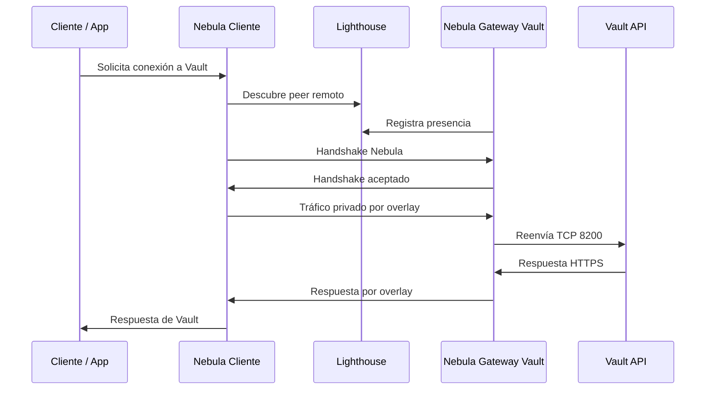
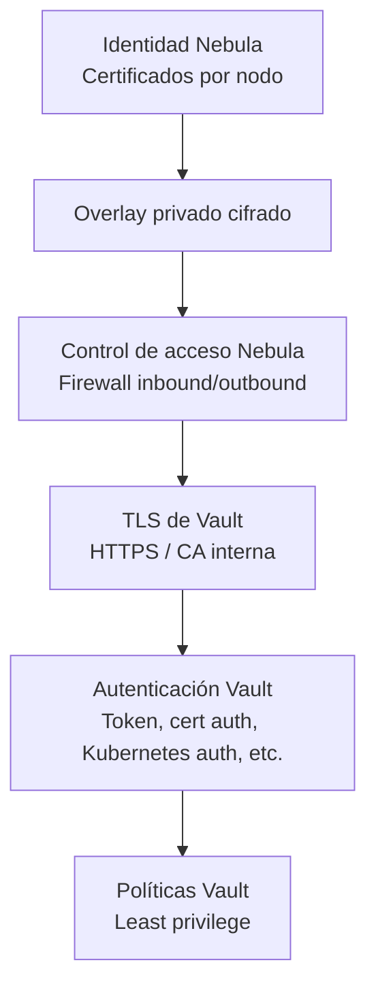
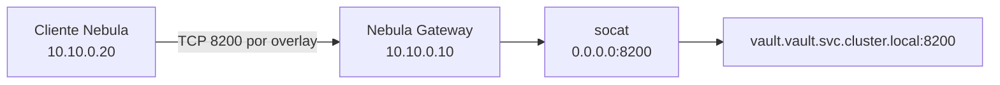
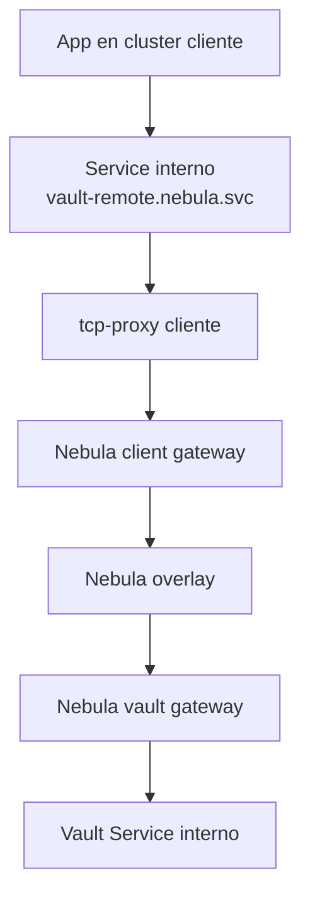

TODO [Nebula](https://nebula.defined.net/docs/)

# Conexión Zero Trust hacia Vault usando Nebula

## Componentes principales

| Componente | Descripción |
|---|---|
| Vault | Servicio de gestión de secretos desplegado en Kubernetes. |
| Nebula | Red overlay cifrada basada en certificados. |
| Lighthouse | Nodo público usado para descubrimiento y coordinación entre peers Nebula. |
| Vault Gateway | Pod dentro del cluster de Vault que ejecuta Nebula y permite acceso privado hacia Vault. |
| Cliente Nebula | Nodo cliente que se conecta al overlay Nebula desde WSL o desde otro cluster. |
| Certificados Nebula | Identidad criptográfica de cada nodo Nebula. |
| Certificados TLS de Vault | Certificados usados por Vault para HTTPS/mTLS. |

---

## Arquitectura actual validada

En la arquitectura actual, Vault se ejecuta dentro de un cluster Kubernetes basado en K3s. Dentro del mismo cluster se despliega un `Deployment` de Nebula que actúa como gateway hacia Vault.

El cliente se ejecuta desde WSL y se conecta a la red Nebula mediante su propio certificado.



---

## Arquitectura objetivo cluster-a-cluster

En una siguiente etapa, el cliente en WSL será reemplazado por un segundo cluster Kubernetes. En ese caso, cada cluster tendrá un gateway Nebula propio.



---

## Flujo general de comunicación



---

## Modelo de seguridad

La arquitectura separa varias capas de seguridad:



### Capas aplicadas

1. **Identidad de red con Nebula**

   Cada nodo tiene un certificado firmado por la CA de Nebula. El acceso al overlay depende de la identidad del nodo.

2. **Red privada overlay**

   Vault no se expone directamente. El tráfico viaja por la red privada Nebula.

3. **Firewall de Nebula**

   Se pueden limitar los puertos, protocolos y hosts permitidos dentro del overlay.

4. **TLS de Vault**

   Aunque Nebula ya cifra el tráfico, Vault mantiene HTTPS con su propio certificado.

5. **Autenticación y autorización de Vault**

   Nebula permite llegar a Vault, pero no autoriza acceso a secretos. Esa decisión sigue siendo responsabilidad de Vault.

---

## Direccionamiento propuesto

| Nodo | IP Nebula | Descripción |
|---|---:|---|
| Lighthouse | `10.10.0.1` | Nodo público de descubrimiento. |
| Vault Gateway | `10.10.0.10` | Gateway Nebula dentro del cluster de Vault. |
| Cliente WSL | `10.10.0.20` | Cliente Nebula externo temporal. |
| Futuro Cluster Cliente | `10.10.0.20` | Gateway Nebula dentro del cluster cliente. |

---

## Prerrequisitos

### Infraestructura

- Cluster Kubernetes para Vault.
- Vault desplegado y accesible internamente mediante un Service.
- Lighthouse Nebula con IP pública.
- Certificados Nebula generados.
- Conectividad UDP hacia el lighthouse.
- Cliente Nebula instalado en WSL o en otro nodo.

### Kubernetes

Se requiere un namespace para Nebula:

```bash
kubectl create namespace nebula
```

También se recomienda tener un ServiceAccount específico:

```bash
kubectl create serviceaccount nebula-vault-gateway -n nebula
```

---

## Certificados Nebula

Nebula utiliza una CA propia para firmar certificados de cada nodo.

Ejemplo de identidades:

| Certificado | Nombre | IP |
|---|---|---|
| Lighthouse | `vault-lighthouse` | `10.10.0.1/24` |
| Vault Gateway | `vault-gateway` | `10.10.0.10/24` |
| Cliente | `client-wsl` | `10.10.0.20/24` |

Ejemplo conceptual:

```bash
nebula-cert ca -name "lab-nebula-ca"

nebula-cert sign \
  -name "vault-lighthouse" \
  -ip "10.10.0.1/24"

nebula-cert sign \
  -name "vault-gateway" \
  -ip "10.10.0.10/24"

nebula-cert sign \
  -name "client-wsl" \
  -ip "10.10.0.20/24"
```

Los archivos generados normalmente incluyen:

```bash
ca.crt
vault-lighthouse.crt
vault-lighthouse.key
vault-gateway.crt
vault-gateway.key
client-wsl.crt
client-wsl.key
```

---

## Configuración del lighthouse

El lighthouse es el nodo con IP pública que permite que los peers Nebula se descubran entre sí.

Ejemplo de configuración conceptual:

```yaml
pki:
  ca: /etc/nebula/ca.crt
  cert: /etc/nebula/lighthouse.crt
  key: /etc/nebula/lighthouse.key

static_host_map: {}

lighthouse:
  am_lighthouse: true
  hosts: []

listen:
  host: 0.0.0.0
  port: 4242

punchy:
  punch: true
  respond: true

tun:
  disabled: false
  dev: nebula1
  mtu: 1300

logging:
  level: info
  format: text

firewall:
  outbound_action: drop
  inbound_action: drop

  outbound:
    - port: any
      proto: any
      host: any

  inbound:
    - port: any
      proto: icmp
      host: any

    - port: 4242
      proto: udp
      host: any
```

Ejecutar Nebula en el lighthouse:

```bash
nebula -config /etc/nebula/config.yml
```

---

## Configuración del Vault Gateway en Kubernetes

El gateway Nebula dentro del cluster de Vault necesita:

- Certificado Nebula del nodo `vault-gateway`.
- Acceso a `/dev/net/tun`.
- Permisos de red necesarios para crear la interfaz Nebula.
- Comunicación hacia el Service interno de Vault.
- Opción de `hostNetwork: true` si se requiere que el puerto UDP sea realmente alcanzable desde fuera o desde el nodo.

---

## Secret con certificados Nebula

Los certificados pueden cargarse como un Secret de Kubernetes:

```bash
kubectl create secret generic nebula-vault-gateway-certs \
  -n nebula \
  --from-file=ca.crt=ca.crt \
  --from-file=host.crt=vault-gateway.crt \
  --from-file=host.key=vault-gateway.key
```

---

## ConfigMap con configuración de Nebula para Vault Gateway

Ejemplo general:

```yaml
apiVersion: v1
kind: ConfigMap
metadata:
  name: nebula-vault-gateway-config
  namespace: nebula
data:
  config.yml: |
    pki:
      ca: /etc/nebula/certs/ca.crt
      cert: /etc/nebula/certs/host.crt
      key: /etc/nebula/certs/host.key

    static_host_map:
      "10.10.0.1": ["PUBLIC_LIGHTHOUSE_IP:4242"]

    lighthouse:
      am_lighthouse: false
      hosts:
        - "10.10.0.1"

    listen:
      host: 0.0.0.0
      port: 4242

    punchy:
      punch: true
      respond: true

    tun:
      disabled: false
      dev: nebula1
      mtu: 1300

    logging:
      level: info
      format: text

    firewall:
      outbound_action: drop
      inbound_action: drop

      outbound:
        - port: any
          proto: any
          host: any

      inbound:
        - port: any
          proto: icmp
          host: any

        - port: 8200
          proto: tcp
          host: 10.10.0.20
```

> Nota: reemplazar `PUBLIC_LIGHTHOUSE_IP` por la IP pública real del lighthouse.

---

## Deployment del Vault Gateway

Ejemplo general usando Nebula dentro del cluster:

```yaml
apiVersion: apps/v1
kind: Deployment
metadata:
  name: nebula-vault-gateway
  namespace: nebula
spec:
  replicas: 1
  selector:
    matchLabels:
      app: nebula-vault-gateway
  template:
    metadata:
      labels:
        app: nebula-vault-gateway
    spec:
      hostNetwork: true
      dnsPolicy: ClusterFirstWithHostNet

      serviceAccountName: nebula-vault-gateway
      automountServiceAccountToken: false

      containers:
        - name: nebula
          image: nebulaoss/nebula:latest
          args:
            - "-config"
            - "/etc/nebula/config/config.yml"

          securityContext:
            privileged: true

          volumeMounts:
            - name: nebula-config
              mountPath: /etc/nebula/config
              readOnly: true

            - name: nebula-certs
              mountPath: /etc/nebula/certs
              readOnly: true

      volumes:
        - name: nebula-config
          configMap:
            name: nebula-vault-gateway-config

        - name: nebula-certs
          secret:
            secretName: nebula-vault-gateway-certs
```

---

## Acceso hacia Vault desde el Gateway

Nebula únicamente crea la red overlay. Para que el tráfico recibido por el gateway llegue a Vault, se requiere una forma de reenviar el tráfico TCP hacia el Service interno de Vault.

Una opción simple es usar un contenedor adicional con `socat`.



Ejemplo conceptual del sidecar:

```yaml
- name: tcp-proxy
  image: alpine/socat
  args:
    - TCP-LISTEN:8200,fork,reuseaddr
    - TCP:vault.vault.svc.cluster.local:8200
```

El `Deployment` completo puede tener dos contenedores:

- `nebula`: crea la red overlay.
- `tcp-proxy`: escucha en `8200` y reenvía hacia el Service interno de Vault.

---

## Ejemplo de Deployment con Nebula y tcp-proxy

```yaml
apiVersion: apps/v1
kind: Deployment
metadata:
  name: nebula-vault-gateway
  namespace: nebula
spec:
  replicas: 1
  selector:
    matchLabels:
      app: nebula-vault-gateway
  template:
    metadata:
      labels:
        app: nebula-vault-gateway
    spec:
      hostNetwork: true
      dnsPolicy: ClusterFirstWithHostNet

      serviceAccountName: nebula-vault-gateway
      automountServiceAccountToken: false

      containers:
        - name: nebula
          image: nebulaoss/nebula:latest
          args:
            - "-config"
            - "/etc/nebula/config/config.yml"

          securityContext:
            privileged: true

          ports:
            - name: nebula-udp
              containerPort: 4242
              protocol: UDP

          volumeMounts:
            - name: nebula-config
              mountPath: /etc/nebula/config
              readOnly: true

            - name: nebula-certs
              mountPath: /etc/nebula/certs
              readOnly: true

        - name: tcp-proxy
          image: alpine/socat
          args:
            - TCP-LISTEN:8200,fork,reuseaddr
            - TCP:vault.vault.svc.cluster.local:8200

          ports:
            - name: vault-proxy
              containerPort: 8200
              protocol: TCP

      volumes:
        - name: nebula-config
          configMap:
            name: nebula-vault-gateway-config

        - name: nebula-certs
          secret:
            secretName: nebula-vault-gateway-certs
```

---

## Configuración del cliente en WSL

El cliente Nebula en WSL usa su propio certificado y se conecta al lighthouse.

Ejemplo:

```yaml
pki:
  ca: /home/user/nebula/ca.crt
  cert: /home/user/nebula/client-wsl.crt
  key: /home/user/nebula/client-wsl.key

static_host_map:
  "10.10.0.1": ["PUBLIC_LIGHTHOUSE_IP:4242"]

lighthouse:
  am_lighthouse: false
  hosts:
    - "10.10.0.1"

listen:
  host: 0.0.0.0
  port: 0

punchy:
  punch: true
  respond: true

tun:
  disabled: false
  dev: nebula1
  mtu: 1300

logging:
  level: info
  format: text

firewall:
  outbound_action: drop
  inbound_action: drop

  outbound:
    - port: any
      proto: any
      host: any

  inbound:
    - port: any
      proto: icmp
      host: any
```

Ejecutar Nebula en WSL:

```bash
sudo nebula -config ./config.yml
```

---

## Validación de conectividad Nebula

### Ver logs del gateway

```bash
kubectl logs -n nebula deployment/nebula-vault-gateway -c nebula
```

### Ver logs del proxy TCP

```bash
kubectl logs -n nebula deployment/nebula-vault-gateway -c tcp-proxy
```

### Entrar al contenedor del proxy TCP

```bash
kubectl exec -it -n nebula deployment/nebula-vault-gateway -c tcp-proxy -- sh
```

### Probar ping desde WSL

```bash
ping 10.10.0.10
```

### Probar conexión TCP hacia Vault

```bash
curl -vk https://10.10.0.10:8200/v1/sys/health
```

Si Vault usa un certificado que no incluye la IP `10.10.0.10` como SAN, es mejor probar usando un hostname incluido en el certificado.

Ejemplo:

```bash
curl -vk \
  --resolve vault-gateway.nebula:8200:10.10.0.10 \
  https://vault-gateway.nebula:8200/v1/sys/health
```

---

## Consideraciones TLS para Vault

Aunque Nebula proporciona cifrado de red, Vault debe seguir usando TLS propio.

Esto permite:

- Validar identidad del servidor Vault.
- Mantener compatibilidad con clientes estándar.
- Usar mTLS o `cert auth` en Vault si se requiere.
- Evitar depender únicamente del overlay para la seguridad de la aplicación.

Si se accede a Vault mediante un nuevo hostname, por ejemplo:

```bash
vault-gateway.nebula
```

Entonces ese nombre debería agregarse a los `dnsNames` del certificado TLS de Vault.

Ejemplo conceptual:

```yaml
dnsNames:
  - vault
  - vault.vault
  - vault.vault.svc
  - vault.vault.svc.cluster.local
  - vault-gateway.nebula
```

Después de actualizar el certificado, puede ser necesario reiniciar Vault si el proceso no recarga automáticamente los certificados.

---

## Validación de Vault

### Ver estado de Vault desde el cliente

```bash
curl \
  --cacert ca.crt \
  --resolve vault-gateway.nebula:8200:10.10.0.10 \
  https://vault-gateway.nebula:8200/v1/sys/health
```

### Respuesta esperada si Vault está inicializado y unsealed

```json
{
  "initialized": true,
  "sealed": false,
  "standby": false,
  "performance_standby": false,
  "replication_performance_mode": "disabled",
  "replication_dr_mode": "disabled",
  "server_time_utc": 0000000000,
  "version": "x.x.x",
  "cluster_name": "vault-cluster",
  "cluster_id": "..."
}
```

### Respuesta esperada si Vault está sellado

```json
{
  "initialized": true,
  "sealed": true
}
```

---

## Verificación de rutas dentro del cluster

Desde el contenedor `tcp-proxy` se puede verificar si el Service interno de Vault resuelve correctamente:

```bash
nslookup vault.vault.svc.cluster.local
```

También se puede probar conectividad TCP:

```bash
nc -vz vault.vault.svc.cluster.local 8200
```

O con curl:

```bash
curl -vk https://vault.vault.svc.cluster.local:8200/v1/sys/health
```

---

## Troubleshooting

### 1. Handshake timeout

Síntoma:

```bash
Handshake timed out
```

Posibles causas:

- El puerto UDP del lighthouse no está abierto.
- El peer no puede responder por NAT.
- El `static_host_map` apunta a una IP incorrecta.
- El gateway Nebula está escuchando en un nodo distinto al puerto mapeado.
- En kind, el puerto UDP no está expuesto correctamente hacia el nodo donde corre el pod.
- Firewall local o de nube bloqueando UDP.

Validaciones:

```bash
kubectl logs -n nebula deployment/nebula-vault-gateway -c nebula
```

```bash
netstat -anu
```

```bash
sudo ss -lunp
```

---

### 2. Refusing to handshake with myself

Síntoma:

```bash
Refusing to handshake with myself
```

Causa común:

- Dos nodos están usando el mismo certificado Nebula.
- El lighthouse y otro peer usan la misma identidad.
- Se copió por error el mismo `.crt` y `.key` en más de un nodo.

Solución:

- Verificar que cada nodo tenga un certificado único.
- Revisar el `name` y la IP dentro de cada certificado.
- Regenerar certificados si es necesario.

Ejemplo para inspeccionar un certificado:

```bash
nebula-cert print -path host.crt
```

---

### 3. Error IPv4 / IPv6

Síntoma:

```bash
listener is IPv4, but writing to IPv6 remote
```

Posibles causas:

- Nebula está resolviendo una dirección IPv6 para un peer.
- El listener está configurado solo para IPv4.
- El `static_host_map` usa un hostname que resuelve a IPv6.

Soluciones:

- Usar IP pública IPv4 explícita en `static_host_map`.
- Evitar hostnames que puedan resolver a IPv6.
- Revisar DNS del host.
- Confirmar que el lighthouse escucha en IPv4.

---

### 4. Ping funciona pero curl a Vault no

Posibles causas:

- Nebula conecta, pero el proxy TCP no está funcionando.
- Vault no está escuchando en el Service esperado.
- El firewall de Nebula permite ICMP pero no TCP 8200.
- El certificado TLS de Vault no coincide con el hostname usado.
- Vault está sealed.
- Vault está inicializado pero no unsealed.

Validaciones:

```bash
kubectl logs -n nebula deployment/nebula-vault-gateway -c tcp-proxy
```

```bash
kubectl get svc -n vault
```

```bash
curl -vk https://10.10.0.10:8200/v1/sys/health
```

---


## Próximo paso: cluster-a-cluster

Para pasar de WSL a cluster-a-cluster, se recomienda desplegar un segundo gateway Nebula en el cluster cliente.

Ese gateway puede exponer un Service interno para que las aplicaciones del cluster cliente hablen con Vault sin conocer detalles de Nebula.



### Patrón recomendado

En el cluster cliente:

- Un Deployment con Nebula.
- Un sidecar `socat` o proxy TCP.
- Un Service interno llamado, por ejemplo:

```text
vault-remote.nebula.svc.cluster.local
```

Las aplicaciones consumirían Vault usando:

```text
https://vault-remote.nebula.svc.cluster.local:8200
```

El proxy del cluster cliente enviaría el tráfico por Nebula hacia el gateway del cluster de Vault.

---

## Consideraciones para certificados TLS en cluster-a-cluster

Cuando el cliente final consume Vault usando un nombre como:

```text
vault-remote.nebula.svc.cluster.local
```

hay dos opciones:

### Opción 1: agregar ese DNS al certificado de Vault

El certificado de Vault incluye también el nombre usado desde el cluster cliente.

Ejemplo:

```text
vault-remote.nebula.svc.cluster.local
```

Ventaja:

- El cliente valida TLS sin hacks adicionales.

Desventaja:

- El certificado de Vault conoce nombres externos al cluster de Vault.

### Opción 2: usar un hostname estable independiente

Por ejemplo:

```text
vault.internal.example
```

Y mapearlo en el cluster cliente hacia el gateway/proxy.

Ventaja:

- Más limpio y portable.
- Mejor para ambientes reales.

Desventaja:

- Requiere resolver DNS interno o configuración adicional.

---

## Estado actual

La conexión fue validada correctamente con:

- K3s como cluster de Vault.
- Deployment de Nebula dentro del cluster de Vault.
- Cliente Nebula ejecutándose desde WSL.
- Comunicación privada usando la red overlay Nebula.
- Acceso hacia Vault mediante el gateway.

Esto confirma que el patrón es viable para avanzar hacia una implementación cluster-a-cluster.

---

## Resumen

La solución permite conectar clientes o clusters externos hacia Vault sin exponer Vault públicamente.

El patrón recomendado es:

1. Mantener Vault privado dentro de Kubernetes.
2. Desplegar un gateway Nebula en el cluster de Vault.
3. Usar un lighthouse público solo para descubrimiento.
4. Conectar clientes mediante certificados Nebula.
5. Reenviar tráfico TCP hacia el Service interno de Vault.
6. Mantener TLS y autenticación propia de Vault.
7. Evolucionar hacia cluster-a-cluster desplegando otro gateway Nebula en el cluster cliente.

Esta arquitectura mantiene el enfoque Zero Trust porque el acceso depende de identidad criptográfica, conectividad explícita y autorización separada en Vault.
